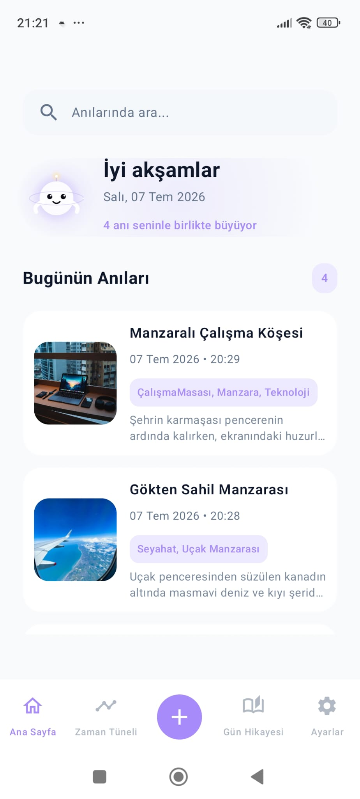
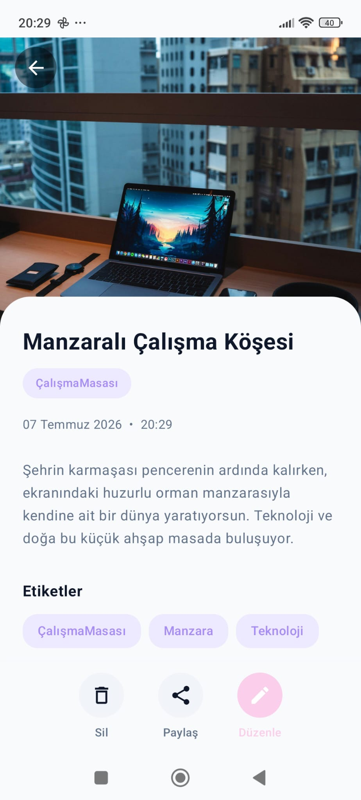
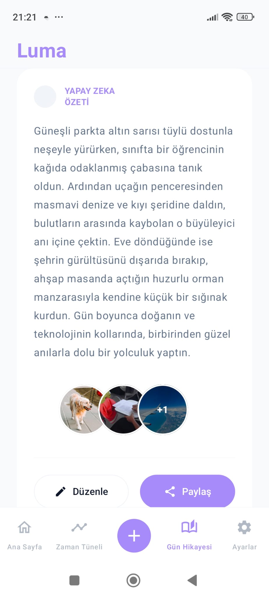
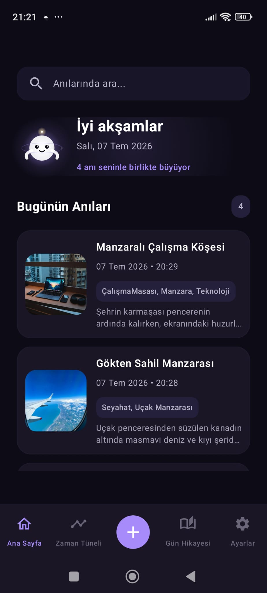
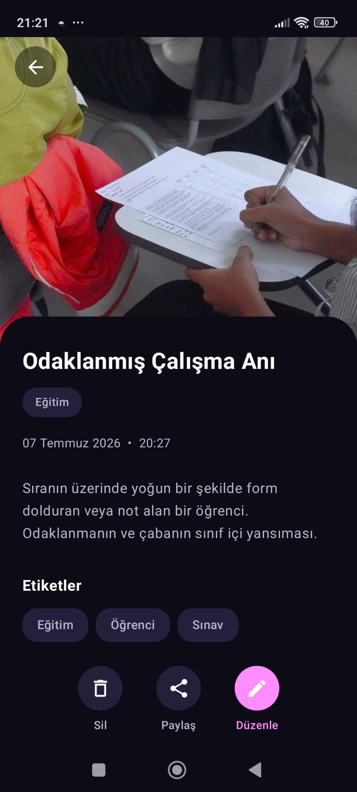
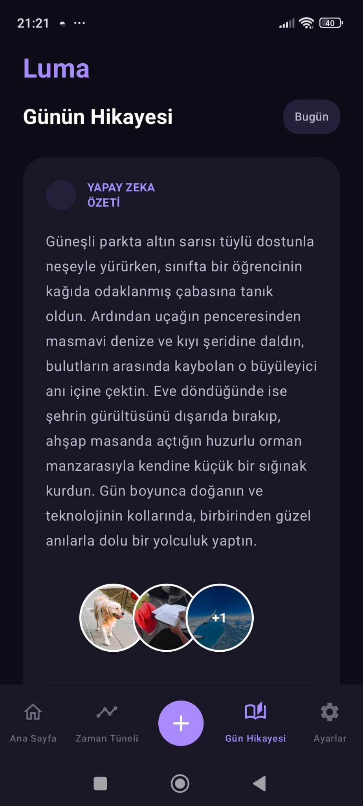

<div align="center">
  <h1>✨ Lume</h1>
  <p><b>Yapay Zeka Destekli Akıllı Günlük ve Anı Uygulamanız</b></p>
</div>

<br/>

Lume, anılarınızı kaydetmeyi yepyeni bir seviyeye taşıyan akıllı bir günlük uygulamasıdır. Fotoğraflarınızı yapay zeka (AI) yardımıyla analiz eder; etkileyici başlıklar, açıklamalar ve ilgili etiketler oluşturarak anılarınızı sizin yerinize zahmetsizce kaydeder. Tamamen **Jetpack Compose** ve modern Android mimarisiyle geliştirilmiştir.

## 🚀 Özellikler

- **Yapay Zeka Destekli Analiz**: LLM (Qwen/OpenAI) API'lerini kullanarak fotoğrafları otomatik olarak inceler, içerik analizi yapar, akıllı başlıklar ve etiketler üretir.
- **Otomatik Kayıt Servisi**: Arka planda çalışarak anılarınızı güvenle sıkıştırır, analiz eder ve kullanıcı deneyiminizi bölmeden kaydeder.
- **Modern UI/UX Tasarımı**: Jetpack Compose ile oluşturulmuş, tamamen duyarlı (responsive) ve şık kullanıcı arayüzü.
- **Çevrimdışı Desteği**: Room veritabanı sayesinde tüm anılarınızı yerel olarak kaydeder ve internet olmadan da erişim sağlar.
- **Karanlık (Dark) & Aydınlık (Light) Mod**: Göz yormayan ve ortama uyum sağlayan özenle hazırlanmış temalar. (Ekran görüntülerine aşağıdan göz atabilirsiniz!)

## 🛠 Kullanılan Teknolojiler (Tech Stack)

- **[Kotlin](https://kotlinlang.org/)** - Android geliştirme için resmi ve birinci sınıf programlama dili.
- **[Jetpack Compose](https://developer.android.com/jetpack/compose)** - Modern, bildirimsel (declarative) yerel Android arayüz geliştirme aracı.
- **[Dagger Hilt](https://dagger.dev/hilt/)** - Android için standart bağımlılık enjeksiyonu (DI) kütüphanesi.
- **[Room Database](https://developer.android.com/training/data-storage/room)** - Güçlü ve güvenli yerel veri depolama aracı.
- **[Coroutines & Flow](https://kotlinlang.org/docs/coroutines-overview.html)** - Arka plan işlemlerini kolaylaştıran asenkron programlama desteği.
- **[Coil](https://coil-kt.github.io/coil/)** - Kotlin Coroutines destekli hızlı ve modern görsel yükleme kütüphanesi.
- **[Retrofit & OkHttp](https://square.github.io/retrofit/)** - Güvenli ve tip destekli ağ istekleri kütüphanesi.
- **[WorkManager](https://developer.android.com/topic/libraries/architecture/workmanager)** - Arka plan görevlerinin zamanlanması ve garantili çalıştırılması için kullanıldı.

## 📸 Ekran Görüntüleri

Lume'un Aydınlık ve Karanlık moddaki görünümüne bir göz atın.

<p align="center">
  
  &nbsp;&nbsp;&nbsp;&nbsp;
  
  &nbsp;&nbsp;&nbsp;&nbsp;
  
</p>
<br/>
<p align="center">
  
  &nbsp;&nbsp;&nbsp;&nbsp;
  
  &nbsp;&nbsp;&nbsp;&nbsp;
  
</p>
<p align="center">
  <i>Lume'un farklı ekranlarındaki Aydınlık (Light) ve Karanlık (Dark) mod tasarımları</i>
</p>

## 🏗 Mimari & Teknik Altyapı

Lume, ölçeklenebilir ve test edilebilir bir yapı sunmak için aşağıdaki modern prensipler üzerine inşa edilmiştir:

- **MVVM** ve **Clean Architecture**: Katmanlı mimari (Domain, Data, UI) sayesinde sürdürülebilir ve test edilebilir kod yapısı.
- **Hilt (Dependency Injection)**: Uygulama genelinde modüler bağımlılık yönetimi.
- **Room DB**: Çevrimdışı öncelikli (Offline-first) stratejisi ve güçlü SQL sorguları ile veri kalıcılığı.
- **Kotlin Coroutines & StateFlow (UDF)**: Unidirectional Data Flow prensibine dayalı asenkron state yönetimi ve reaktif UI güncellemeleri.
- **Google ML Kit OCR & OpenAI Hybrid Vision API Integration**: Karmaşık AI analizlerini arka planda (Foreground Service vb.) güvenle yürüten ileri seviye entegrasyonlar.

## ⚙️ Kurulum & Çalıştırma

1. **Projeyi klonlayın:**
   ```bash
   git clone https://github.com/ServetErdogan09/Luma.git
   ```
2. **Android Studio ile açın.**
3. **API Anahtarlarını Ekleyin:**
   Proje ana dizininde bir `local.properties` dosyası oluşturun ve gerekli API anahtarlarını ekleyin:
   ```properties
   GEMINI_API_KEY=sizin_gemini_api_anahtariniz
   LLMTR_API_KEY=sizin_llmtr_api_anahtariniz
   ```
4. **Projeyi derleyip (Build & Run)** bir emülatör veya fiziksel cihaz üzerinde test edin.

## 📝 Lisans

```text
Copyright 2026 Servet Erdoğan

Licensed under the Apache License, Version 2.0 (the "License");
you may not use this file except in compliance with the License.
You may obtain a copy of the License at

   http://www.apache.org/licenses/LICENSE-2.0
```
